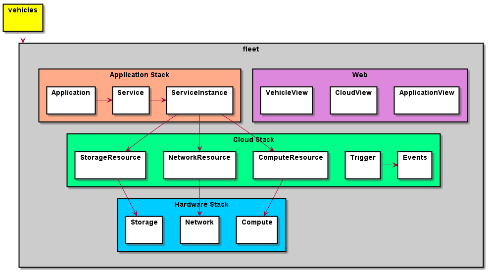

# fleet

fleet simulator for the Modern data center. This does not actually provision software or hardware, but similates how
it happens in a multi, hybrid cloud environment. There are three subsystems of the architecture.
Application Stack, Cloud Stack, Hardware Stack. Vehicles are connected to the Data Center via the Services and the Cloud layer.

### Links

+ [Documentation](http://fleet.readthedocs.io)
+ [GitHub Repo](https://github.com/CAADE/fleet)
* [Docker Contaier madajaju/fleet](https://hub.docker.com/r/madajaju/fleet)

