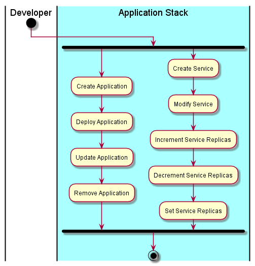

.. _Developer:

Developer
=========
Developer is repsonsible for managing applications and the development of applications.

Use Cases
---------

* :ref:`UseCase-Manage-Applications`

Activities
----------
* Manage Application
* Manage Service
* Increase and Decrease Service Replicas

Workflow
--------
When an Application is created all of its services are created with the default number of replicas.

