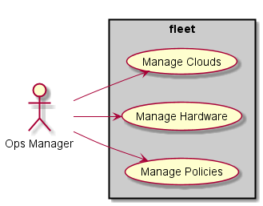
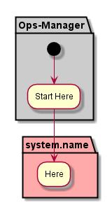
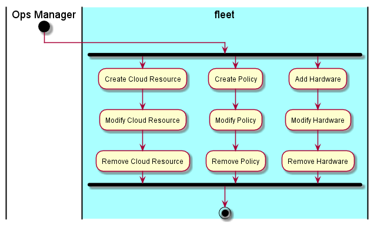

.. _Ops-Manager:

Operations Manager
==================

Operations Manager is repsonsible for managing the hardware, polcies and cloud resources in the data center.

Use Cases
---------

The following are the Use Cases for the Operations Manager.

* :ref:`UseCase-Manage-Clouds`
* :ref:`UseCase-Manage-Hardware`
* :ref:`UseCase-Manage-Policies`

Activities
----------

The Operations Manager performs the following Activities

Workflow
--------

He is the workflow for the Operations Manager.

