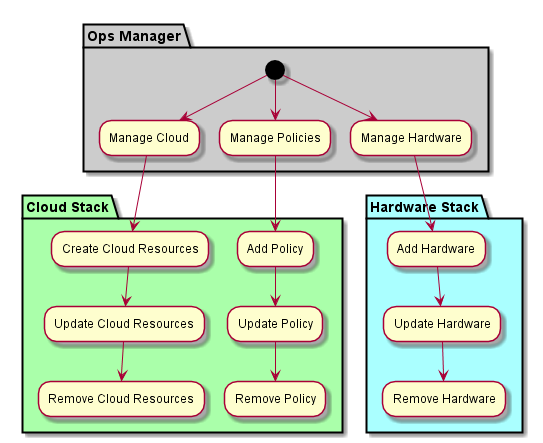

.. _Ops-Manager:

Operations Manager
==================
Operations Manager is repsonsible for managing the hardware, polcies and cloud resources in the data center.

Use Cases
---------
* :ref:`UseCase-Manage-Clouds`
* :ref:`UseCase-Manage-Hardware`
* :ref:`UseCase-Manage-Policies`

.. image:: UseCases.png

Activities
----------

Workflow
--------

.. image:: Workflow.png

