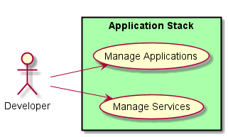
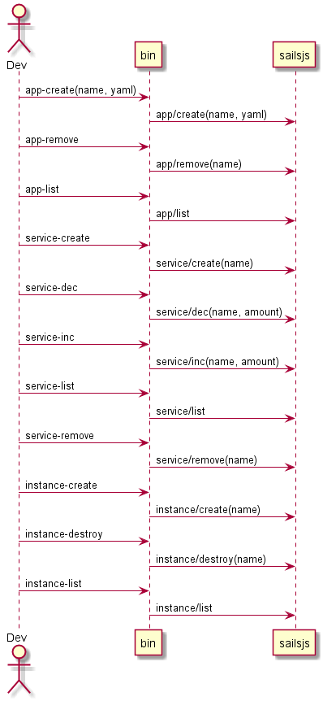
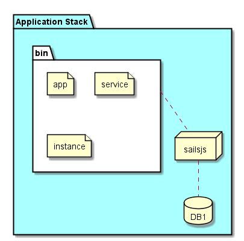

Application Stack
=================

The application stack manages applications, services and Service Instance.

Use Cases
---------

* :ref:`UseCase-Manage-Applications` - see here to find details on the interface.

Users
-----

* :ref:`Developer`

Uses
----

* :ref:`SubSystem-Application-Stack`
* :ref:`SubSystem-Cloud-Stack`

Interface
---------
* CLI - Command Line Interface,
* REST-API - Standard REST interface through the Sailsjs application
* Portal - Web Portal - Delivered through the sailsjs application

Logical Artifacts
-----------------
* Application - contains multiple services.
* Service - represents a micro services. It has replicas which is shown as ServiceInstances.
* ServiceInstance - an instance of a service determined by the number of replicas.
* CloudResource - A Cloud Resource that the ServiceInstance runs on or consumes resources from the Cloud (compute, storage, network)

Activities and Flows
--------------------
A typical application stack workflow or activity follows these basic patterns:
* Create Application
* Modify Application
* Delete Application

Deployment Architecture
-----------------------
The fleet application is deployed with the default database for a sailsjs application.

Physical Architecture
---------------------
There are three interfaces to the Application Stack subsystem. CLI, Web, and REST. The CLI communicates
with the Application Stack via the REST interface. All REST interfaces are accessible via a CLI. The Web interface
utilizes the sails.io subsystem to have a web interface that is interaction with the sailsj application without
pooling (COMET).

