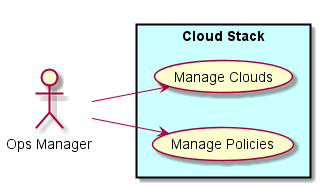
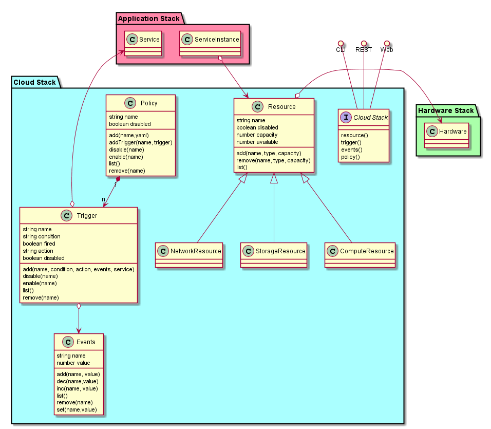
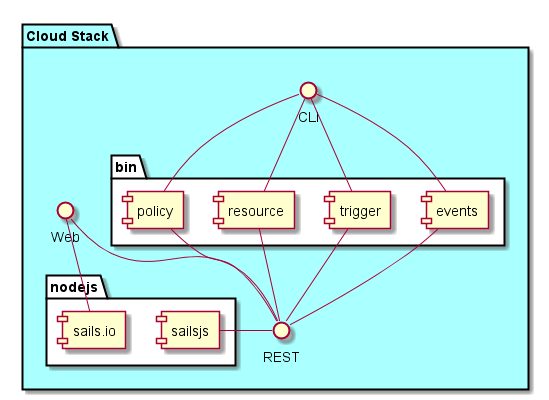

.. _SubSystem-Cloud-Stack:

Cloud Stack
===========

Cloud Stack is a subsystem of fleet and is responsible for the management of cloud resources across multiple clouds.
It is responsible for the orchestration and provisioning of services on Cloud Resrouces (compute, storage, and network)

Use Cases
---------

* :ref:`UseCase-Manage-Clouds`
* :ref:`UseCase-Manage-Policies`

Users
-----

* :ref:`Ops-Manager`

Uses
----

* :ref:`SubSystem-Cloud-Stack`
* :ref:`SubSystem-Hardware-Stack`

Interface
---------

* CLI - Command Line Interface
* REST-API -
* Portal - Web Portal

Logical Artifacts
-----------------

* Events - Events in the system this represents a number of the events. Not the individual events.
* Policy - Made up of Triggers. Policies are applied to the data center and the cloud.
* Resource - Cloud Resource (compute, network, storage)
* Trigger - Trigger on a event based on a condition and fires and action

Activities and Flows
--------------------
* Manage Policies
* Manage Triggers
* Manage Events
* Manage Resources

Deployment Architecture
-----------------------
The fleet application is deployed with the default database for a sailsjs application.
A CLI is defined in the bin directory.

Physical Architecture
---------------------
There are three interfaces to the Cloud Stack subsystem. CLI, Web, and REST. The CLI communicates
with the Cloud Stack via the REST interface. All REST interfaces are accessible via a CLI. The Web interface
utilizes the sails.io subsystem to have a web interface that is interaction with the sailsj application without
pooling (COMET).

