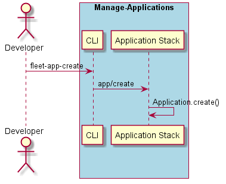

.. _Scenario-Create-Application:

Create Application
==================
Create Application using the CLI with the name and a filename with a specific yaml file.

.. code-block:: none

    # fleet app create --name <name> --filename <filename>
    # fleet aoo create --name alert --filename app.yaml

The application yaml file  follows the following format.

.. code-block:: yaml

    application:
      name: <application name>
      resources:
        network:
          <network name>: <quantity>
        storage:
          <storage name>: <quantity>
      services:
        <service name>:
          type: 'service'
          replicas: <# of replicas>
          storage: <storage name>
          network: <network name>
          links:
            - <service name>
            - <service name>

This is an example of the application yaml file. In this example the name of the application
is "alert" and it has four services: ingestion, annotation, streaming, and notificationGateway.
Resources are also specified using the the network and storage directives. MyNetwork (network)
and myStorage and externalStorage (Storage).

.. code-block:: yaml

    application:
      name: alert
      resources:
        network:
          myNetwork: 150
        storage:
          myStorage: 1000
          externalStorage: 5000
      services:
        ingestion:
          type: 'service'
          replicas: 8
          storage: myStorage
          network: myNetwork
          links:
            - annotation
            - streaming
        annotation:
          type: 'service'
          replicas: 8
          network: myNetwork
        streaming:
          type: 'service'
          replicas: 8
          network: myNetwork
          links:
            - notificationGateway
        notificationGateway:
          type: 'service'
          replicas: 4
          network: myNetwork
          storage: externalStorage

