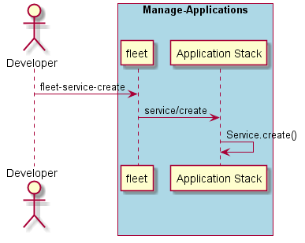

.. _Scenario-Create-Service:

Create Service
==============
Create a Service using the CLI with a specific name.

.. code-block:: none

    # fleet service create --name <name>
    # fleet service create --name ingestion

