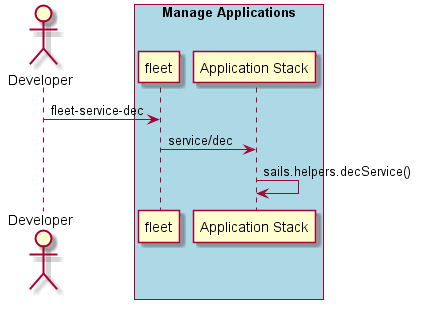

.. _Scenario-Decrement-Service-Replicas:

Decrement Service Replicas
==========================
Decrement service replicas by the amount specified. This will decrease the number of service instance(containers)
in the simulation.

.. code-block:: none

    # fleet service dec --name <name> --amount <quantity>
    # fleet service dec --name ingestion --amount 5

