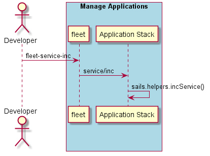

.. _Scenario-Increment-Service-Replicas:

Increment Service Replicas
==========================
Increment service replicas by the amount specified. This will increase the number of service
instance(containers) in the simulation.

.. code-block:: none

    # fleet service inc --name <name> --amount <quantity>
    # fleet service inc --name ingestion --amount 5

