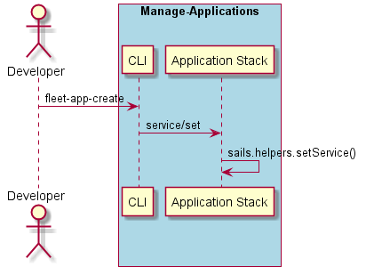

.. _Scenario-Set-Service-Replicas:

Set Service Replicas
====================
Set the number of replicas of a service. This will increase or decrease the instances to match the replicas
of the service.

.. code-block:: none

    # fleet service set --name <name> --amount <quantity>
    # fleet service set --name ingestion --amount 10

