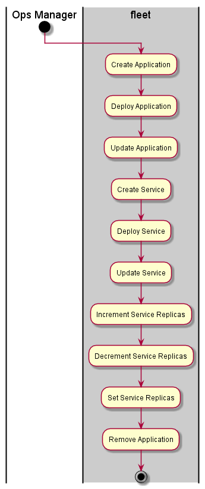

.. _UseCase-Manage-Applications:

Use Case Manage Applications
============================
Manage Applications is primarly by the :ref:`Actor-Ops-Manager`. This includeds the creations,
deployment and management of applications and services.

Actors
------

* :ref:`Actor-Ops-Manager`

Activities
----------

* Manage Applications
* Manage Services
* Manage Service Instances

Detail Scenarios
----------------

.. toctree::
   :glob:
   :maxdepth: 1

   Scenario*

Systems Involved
----------------

* :ref:`SubSystem-Application-Stack`

