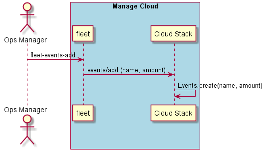

.. _Scenario-Add-Events:

Add Events
==========
Add Events to the Data Center. Events represent the aggregate value of the events. Not the individual events
themselves. Just the total number of events or the total amount.

.. code-block:: none

    # fleet events add --name <name> --amount <quantity>
    # fleet events add --name tps --amount 4000

