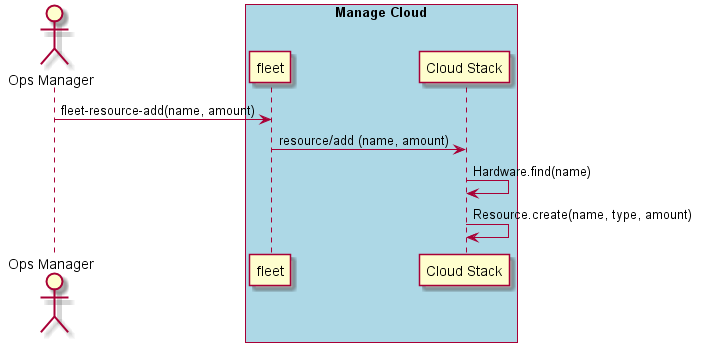

.. _Scenario-Add-Resource:

Add Resource
============
Add a resource of one of the types: 'network', 'compute', 'storage' to the data center.
The name of the hardware will specified and the type of the resource determined by the hardware.

.. code-block:: none

    # fleet resource add --name <name> --amount <quantity>

* Create 10 reousrces on the Compute-1 Hardware.  In this case compute type.

.. code-block:: none

    # fleet resource add --name 'Compute-1' --amount 10

* Create 2 storage resources on the Storage-1 Hardware.  In this case storage type.

.. code-block:: none

    # fleet resource add --name 'Storage-1' --amount 2

* Create 5 network resources on the Network-1 Hardware.  In this case storage type.

.. code-block:: none

    # fleet resource add --name 'Network-1' --amount 5

