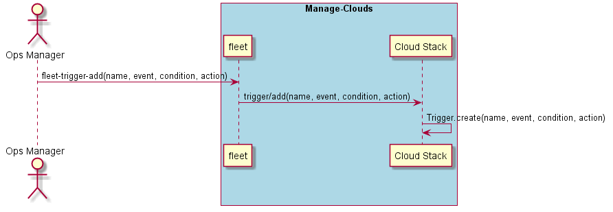

.. _Scenario-Add-Trigger:

Add Trigger
===========
Add Trigger to the data center. A trigger consists of the name, events, condition and action.
A trigger is triggered when the condition is met and the action is performed.

.. code-block:: none

    # fleet trigger add --name <name> --condition <condition> --action <action> --event <event name>

* events - the name of the events that is monitored.
* name - name of the trigger
* condition - Condition to be met. events variable is the events specified from the name. events.value gives you the value of the events.
* action - action to be performed when the condition is met. This is written in javascript

In the example below when the number of accidents is greater than 1000 then the action will be called.
The action will increment service streaming by 10 replicas and increase the service notificationGateway by 5 replicas.

.. code-block:: none

    # fleet trigger add --name accidents --events accident --condition "events.value>100;" --action "sails.helpers.incService('streaming',10);sails.helpers.incService('notificationGateway',5)"

Look at the helpers directory for actions that are easily called.
