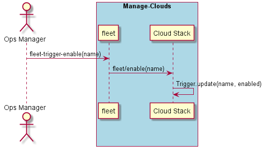

.. _Scenario-Enable-Trigger:

Enable Trigger
==============
Enable a Trigger. This will enable the trigger to fire when conditions are met.

.. code-block:: none

    # fleet trigger enable --name <name>

