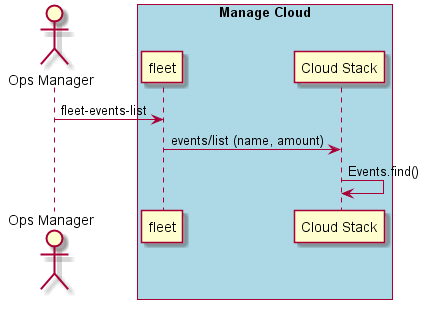

.. _Scenario-List-Events:

List Events
===========
List the Events in the Data Center. Events represent the aggregate value of the events. Not the individual events
themselves. Just the total number of events or the total amount.

.. code-block:: none

    # fleet events list
    Name        Amount
    =========   ==========
    tps         4000
    ingestion   1000
    api         2000

