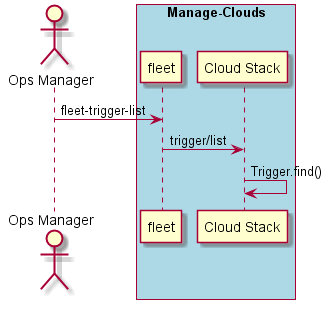

.. _Scenario-List-Trigger:

List Trigger
============
List the triggers in the data center.

.. code-block:: none

    # fleet trigger list
    Name        Events        Condition          Action
    =========   ===========   =============      ==========================================
    accident1   accident      events.value>100   sails.helpers.incService('ingestion', 10);
    accident2   accident      events.value>200   sails.helpers.incService('ingestion', 10);
    accident3   accident      events.value<200   sails.helpers.decService('ingestion', 10);
    accident4   accident      events.value<100   sails.helpers.decService('ingestion', 10);

