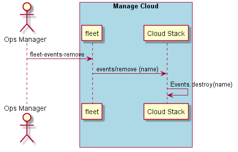

.. _Scenario-Remove-Events:

Remove Events
=============
Remove the Events in the Data Center. Events represent the aggregate value of the events. Not the individual events
themselves. Just the total number of events or the total amount.

.. code-block:: none

    # fleet events remove --name <name>
    # fleet events remove --name tps

