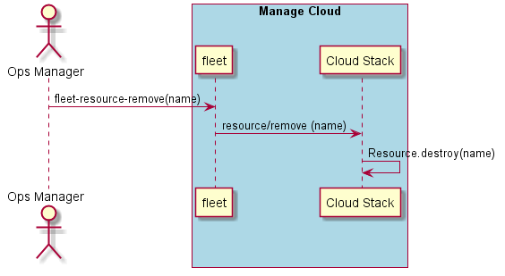

.. _Scenario-Remove-Resource:

Remove Resource
===============
Remove the Resource from the data center given by the name.

.. code-block:: none

    # fleet resource remove --name <resource name>
    # fleet resource remove --name 'Compute-1-1'
    # fleet resource remove --name 'Network-1-1'
    # fleet resource remove --name 'Storage-1-1'

