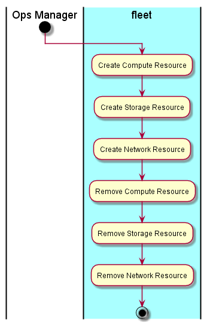

.. _UseCase-Manage-Clouds:

Manage Clouds
=============
Allow the :ref:`Actor-Ops-Manager` to add cloud resource to the data center. Map the hardware and
resources together. The type of the resource is determined by the hardware specified by the name.

Actors
------

* :ref:`Actor-Ops-Manager`

Activities
----------
* Manage Compute Resources
* Manage Storage Resources
* Manage Network Resources
* Map Hardware to Resources

Detail Scenarios
----------------

.. toctree::
   :glob:
   :maxdepth: 1

   Scenario*

Systems Involved
----------------

* :ref:`SubSystem-Cloud-Stack`

