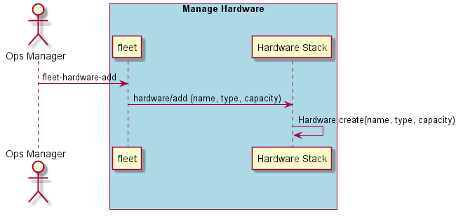

.. _Scenario-Add-Hardware:

Add Hardware
============

Add hardware to the data center.

.. code-block:: none

    # fleet hardware add --name <string> --type <string> --capacity <number>

* Add compute hardware with a capacity of 28 to the datacenter

.. code-block:: none

    # fleet hardware add --name compute1 --type compute --capacity 28

* Add a storage node to the datacenter with a capacity of 10 Terabytes

.. code-block:: none

    # fleet hardware add --name storage1 --type storage --capacity 10000

* Add a network node to the datacenter with a capacity of 254 addresses

.. code-block:: none

    # fleet hardware add --name net1 --type network --capacity 254

