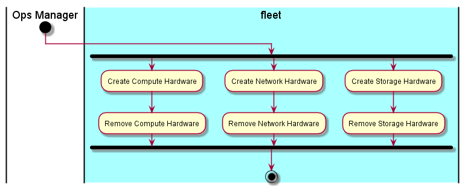

.. _UseCase-Manage-Hardware:

Manage Hardware
===============

The :ref:`Ops-Manager` is responsible for managing the hardware in the data center. The hardware only represents
what is in the data center. There are three types of hardware compute, storage, and network.

Actors
------

* :ref:`Ops-Manager`

Activities
----------

* Manage Compute Hardware
* Manage Network Hardware
* Manage Storage Hardware

Detail Scenarios
----------------

Each scenarios have details of the commands from the Web and the binary command line interface.
Click on each scenario to see the details.

.. toctree::
   :glob:
   :maxdepth: 1

   Scenario*

Systems Involved
----------------

* :ref:`SubSystem-Hardware-Stack`

