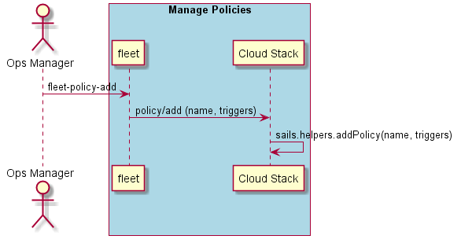

.. _Scenario-Add-Policy:

Add Policy
==========
Add a policy to the data center

.. code-block:: none

    # fleet policy add --name <string> --filename <filename>

The policy is defined by a yaml file format as follows

.. code-block:: yaml

  policy:
      name: <policy name>
      triggers:
       -  events: <event name>
          action: <action code>
          condition: <condition statement>

* <policy name> - is the name of the policy
* <event name> - name of the events that I am watching for this trigger
* <action code> - javascript describing what will be run when the condition is met
* <condition statement> - Conditional statement on when to fire the trigger and run the action.

In the following example a policy sets watches two events (ingestion, tps) and increments or decrements services based
on the levels of the events.

.. code-block:: yaml

    policy:
      triggers:
       -  events: ingestion
          action: sails.helpers.incService('ingestion', 10);
          condition: events.value>1000
       -  events: tps
          action: sails.helpers.incService('ingestion', 10);
          condition: events.value>5000
       -  events: tps
          action: sails.helpers.incService('ingestion', 10);
          condition: events.value>10000
       -  events: ingestion
          action: sails.helpers.decService('ingestion', 10);
          condition: events.value<1000
       -  events: tps
          action: sails.helpers.decService('ingestion', 10);
          condition: events.value<10000
       -  events: ingestion
          action: sails.helpers.decService('ingestion', 10);
          condition: events.value<1000
