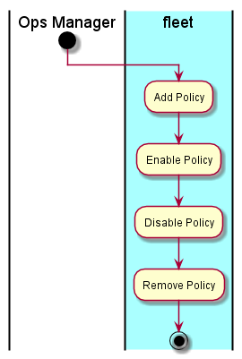

.. _UseCase-Manage-Policies:

Manage Policies
===============

The Ops Manager can set up policies that watch specific events. If the events pass a specific condition then an action
is performed. See :ref:`Scenario-Add-Policy` for format details.

Actors
------

* :ref:`Ops-Manager`

Activities
----------

* Add Policy
* Disable Policy
* Enable Policy
* List Policy
* Remove Policy

Detail Scenarios
----------------

.. toctree::
   :glob:
   :maxdepth: 1

   Scenario*

